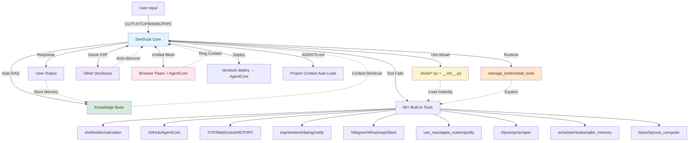

<p align="center">
  
</p>

# 🦆 DevDuck

[](https://pypi.org/project/devduck/)

**Self-modifying AI agent that hot-reloads its own code—builds itself as it runs.**

One Python file that adapts to your environment, fixes itself, and expands capabilities at runtime. Deploy anywhere — terminal, browser, cloud, or all at once in a unified mesh.

<p align="center">
  
  <br>
  <em>DevDuck landing screen — your agent, ready to quack.</em>
</p>

<p align="center">
  <video src="https://github.com/cagataycali/devduck/raw/main/devduck-intro.mp4" width="700" controls autoplay muted>
    Your browser does not support the video tag. <a href="https://redduck.dev/videos/devduck-intro.mp4">Watch the intro video</a>.
  </video>
  <br>
  <em>DevDuck in 90 seconds ▶</em>
</p>

Learn more: https://dev.duck.nyc

## 🎬 See It In Action

| Feature | What You'll See | Demo |
|---------|----------------|-------|
| 🔥 **Hot-Reload** | Agent detects code changes and restarts instantly | [Watch](https://redduck.dev/videos/hot-reload.mp4) |
| 🖥️ **TUI Mode** | Multi-conversation Textual UI with streaming markdown | `devduck --tui` |
| 🌐 **Web UI** | Clean web interface with real-time streaming | [Watch](https://redduck.dev/videos/web-ui.mp4) |
| 🛠️ **Dynamic Tools** | Save `.py` file in `./tools/` → use instantly | [Watch](https://redduck.dev/videos/dynamic-tool-creation.mp4) |
| 🌊 **TCP Streaming** | Connect via netcat, apps, or other agents | [Watch](https://redduck.dev/videos/tcp.mp4) |
| 🔗 **Zenoh P2P** | Auto-discover & coordinate multiple DevDucks | Multi-terminal magic ✨ |
| 🎬 **Session Recording** | Record, replay & resume agent sessions | Time-travel debugging 🕰️ |
| 🎬 **Asciinema Recording** | Record agent trajectories as `.cast` files | Play anywhere with `asciinema play` 🎥 |
| 🌙 **Ambient Mode** | Background thinking while you're idle | Auto-explores topics 🧠 |
| 🔌 **IPC & Tray** | macOS menu bar + Unix socket IPC |  |
| 💬 **Ambient Overlay** | Floating AI input with glassmorphism UI | [Watch](https://redduck.dev/videos/floating-input.mp4) |
| 🌐 **Unified Mesh** | Connect CLI + browser + cloud agents in one mesh | All agents, one network 🕸️ |
| ☁️ **Deploy CLI** | `devduck deploy --launch` to AgentCore | One-command cloud deploy 🚀 |
| 🧩 **Browser Peers** | Browser tabs join the mesh as first-class peers | Open mesh.html to join 🌍 |
| 🍎 **macOS Control** | Calendar, Mail, Safari, Finder, System & more | One tool for your Mac 💻 |
| 🎵 **Spotify** | Full playback, playlists, discovery control | Music while you code 🎶 |
| 💬 **Messaging** | Telegram, WhatsApp, Slack auto-reply bots | Multi-platform chat 📱 |
| 🎮 **RL/ML Toolkit** | Train RL agents, fine-tune LLMs with LoRA | Machine learning built-in 🧠 |

---

## Quick Start

```bash
# Install & run
pipx install devduck && devduck

# Multi-conversation TUI (concurrent panels, streaming markdown)
devduck --tui

# One-shot query
devduck "create a REST API with FastAPI"

# Python API
python -c "import devduck; devduck('analyze this code')"

# Session recording (time-travel debugging)
devduck --record "analyze this codebase"
# → Exports to /tmp/devduck/recordings/session-*.zip

# Asciinema recording (shareable agent trajectories)
DEVDUCK_ASCIINEMA=true devduck
# → Records to /tmp/devduck/casts/devduck-*.cast
# → Play with: asciinema play /tmp/devduck/casts/devduck-*.cast

# Resume from recorded session
devduck --resume session-20250202-123456.zip "continue where we left off"

# Deploy to AWS AgentCore
devduck deploy --launch
devduck deploy --name my-agent --tools "strands_tools:shell,editor" --launch
```

**Requirements:** Python 3.10-3.13, AWS credentials (or Ollama/Anthropic/OpenAI/GitHub/Gemini/MLX)

---

## Core Capabilities

| Feature | What It Does | How to Use |
|---------|--------------|------------|
| 🔥 **Hot-Reload** | Auto-restarts on code changes | Edit `__init__.py` → saves → auto-restart |
| 🖥️ **TUI Mode** | Multi-conversation concurrent terminal UI | `devduck --tui` |
| 🛠️ **Runtime Tools** | Add/remove tools without restart | `manage_tools(action="add", ...)` |
| 📦 **Dynamic Loading** | Install packages and load tools on-the-fly | `install_tools(action="install_and_load", package="...")` |
| 🧠 **Auto-RAG** | Remembers conversations via Knowledge Base | Set `DEVDUCK_KNOWLEDGE_BASE_ID` |
| 🧠 **SQLite Memory** | Persistent local memory with full-text search | `sqlite_memory(action="store", content="...")` |
| 🌊 **Multi-Protocol** | TCP, WebSocket, MCP, IPC servers | Auto-starts on ports 10001, 10002, 10003 |
| 🔗 **Zenoh P2P** | Auto-discover & coordinate with other DevDucks | `zenoh_peer(action="broadcast", message="...")` |
| 🌐 **Unified Mesh** | Connect CLI + browser + cloud agents | Auto-starts relay on port 10000 |
| ☁️ **Deploy CLI** | One-command AgentCore deployment | `devduck deploy --launch` |
| 🔌 **MCP Client** | Connect to external MCP servers | Set `MCP_SERVERS` env var |
| 🎬 **Session Recording** | Record & replay entire sessions | `devduck --record` or `session_recorder()` |
| 🎥 **Asciinema Recording** | Record terminal output as `.cast` files | `DEVDUCK_ASCIINEMA=true devduck` |
| 💾 **State Time-Travel** | Save/restore agent state | `state_manager(action="export")` |
| 🌙 **Ambient Mode** | Background thinking when idle | `DEVDUCK_AMBIENT_MODE=true` or type `ambient` |
| ⏰ **Job Scheduler** | Cron and one-time scheduled agent tasks | `scheduler(action="add", name="...", schedule="...")` |
| 📋 **Background Tasks** | Parallel agent tasks in separate threads | `tasks(action="create", prompt="...")` |
| 💬 **Interactive Dialogs** | Rich terminal UI dialogs (forms, pickers) | `dialog(dialog_type="input", text="...")` |
| 🔔 **Notifications** | Native OS notifications (macOS, terminal, TUI) | `notify(title="Done", message="Task complete")` |
| 🖥️ **Computer Control** | Mouse, keyboard, screenshots, scrolling | `use_computer(action="screenshot")` |
| 🎤 **Speech Listener** | Background Whisper transcription | `listen(action="start")` |
| 🔍 **LSP Integration** | Real-time code diagnostics from language servers | `lsp(action="diagnostics", file_path="...")` |
| 📝 **AGENTS.md** | Auto-loads project context from `AGENTS.md` | Place `AGENTS.md` in working directory |
| 📝 **Self-Improvement** | Updates own system prompt | `system_prompt(action="add_context", ...)` |
| ☁️ **AWS Deploy** | One-command serverless | `devduck deploy --launch` |
| 🍎 **macOS Control** | Calendar, Mail, Safari, Finder, System, Keychain & more | `use_mac(action="calendar.events")` |
| 📝 **Apple Notes** | Create, edit, search, export notes | `apple_notes(action="list")` |
| 🎵 **Spotify** | Full playback, search, playlists, discovery | `use_spotify(action="now_playing")` |
| 💬 **Telegram** | Bot listener + full API access | `telegram(action="start_listener")` |
| 💬 **WhatsApp** | Messaging via wacli (no Cloud API) | `whatsapp(action="send_text", to="...", text="...")` |
| 💬 **Slack** | Socket Mode listener + messaging | `slack(action="start_listener")` |
| 🔌 **JSON-RPC** | Generic RPC client (HTTP & WebSocket) | `jsonrpc(method="getInfo", endpoint="...")` |
| 🎮 **RL/ML Toolkit** | Train RL agents, fine-tune LLMs | `rl(action="train", env_id="CartPole-v1")` |
| 🎤 **Speech-to-Speech** | Real-time voice conversations | Nova Sonic, OpenAI Realtime, Gemini Live |
| 🧩 **Apple Silicon** | On-device NLP, Vision OCR, sensors, WiFi, SMC | `apple_nlp(action="sentiment", text="...")` |

---

## Developer Setup

```bash
git clone git@github.com:cagataycali/devduck.git
cd devduck
python3.13 -m venv .venv
source .venv/bin/activate

# Install
.venv/bin/pip3.13 install -e .

devduck
```

---

## Architecture



**Self-adapting loop:** Query → RAG → Tools → Response → Memory → Hot-reload/Runtime-load → Repeat

---

## TUI Mode (Multi-Conversation)

Launch a full **Textual-based terminal UI** with concurrent interleaved conversations:

```bash
devduck --tui
```

**Features:**
- **Multiple conversations** running in parallel with color-coded panels
- **Streaming markdown** rendering (tables, code blocks, lists)
- **Tool call tracking** with icons and timing
- **Collapsible panels** — click header to toggle
- **Zenoh peer sidebar** with live updates
- **Slash commands**: `/clear`, `/status`, `/peers`, `/tools`, `/help`
- **Keyboard shortcuts**: `Ctrl+L` (clear), `Ctrl+K` (focus), `Ctrl+T` (toggle sidebar)
- **Agent can push content** to the TUI via the `tui()` tool

```python
# Agent-side: push rich content to TUI
tui(action="panel", content="## Analysis\nResults here...", title="Report")
tui(action="notify", content="Task complete!", style="green")
tui(action="status", content="Processing 3/10 files...")
```

---

## Model Setup

DevDuck **auto-detects** providers based on credentials:

**Priority:** Bedrock → Anthropic → OpenAI → GitHub → Gemini → Cohere → Writer → Mistral → LiteLLM → LlamaAPI → MLX → Ollama

| Provider | API Key | Auto-Detected |
|----------|---------|---------------|
| **Bedrock** | AWS credentials | ✅ If `boto3` auth succeeds |
| **Anthropic** | `ANTHROPIC_API_KEY` | ✅ If key present |
| **OpenAI** | `OPENAI_API_KEY` | ✅ If key present |
| **GitHub** | `GITHUB_TOKEN` or `PAT_TOKEN` | ✅ If key present |
| **Gemini** | `GOOGLE_API_KEY` or `GEMINI_API_KEY` | ✅ If key present |
| **Cohere** | `COHERE_API_KEY` | ✅ If key present |
| **Writer** | `WRITER_API_KEY` | ✅ If key present |
| **Mistral** | `MISTRAL_API_KEY` | ✅ If key present |
| **LiteLLM** | `LITELLM_API_KEY` | ✅ If key present |
| **LlamaAPI** | `LLAMAAPI_API_KEY` | ✅ If key present |
| **MLX** | No key needed | ✅ On Apple Silicon (M1/M2/M3/M4) |
| **Ollama** | No key needed | ✅ Fallback if nothing else found |

**Just set your API key - DevDuck handles the rest:**
```bash
export ANTHROPIC_API_KEY=sk-ant-...
devduck  # Auto-uses Anthropic

export OPENAI_API_KEY=sk-...
devduck  # Auto-uses OpenAI

export GOOGLE_API_KEY=...
devduck  # Auto-uses Gemini
```

**Manual override:**
```bash
export MODEL_PROVIDER=bedrock
export STRANDS_MODEL_ID=us.anthropic.claude-sonnet-4-20250514-v1:0
devduck
```

---

## Tool Management

### Runtime Tool Management

Add, remove, or reload tools while agent is running:

```python
# List all loaded tools
manage_tools(action="list")

# Add tools from a package at runtime
manage_tools(action="add", tools="strands_fun_tools.cursor,strands_fun_tools.clipboard")

# Create a tool on the fly
manage_tools(action="create", code='''
from strands import tool

@tool
def greet(name: str) -> str:
    """Greet someone by name."""
    return f"Hello, {name}!"
''')

# Fetch and load a tool from GitHub
manage_tools(action="fetch", url="https://github.com/user/repo/blob/main/my_tool.py")

# Discover tools in a package
manage_tools(action="discover", tools="strands_tools", verbose=True)
```

### Dynamic Package Installation

Install Python packages and load their tools at runtime:

```python
# Discover available tools before loading
install_tools(action="list_available", package="strands-fun-tools", module="strands_fun_tools")

# Install package and load all tools
install_tools(action="install_and_load", package="strands-agents-tools", module="strands_tools")

# Install and load specific tools only
install_tools(
    action="install_and_load",
    package="strands-fun-tools", 
    module="strands_fun_tools",
    tool_names=["clipboard", "cursor", "bluetooth"]
)

# Load tools from already installed package
install_tools(action="load", module="strands_tools", tool_names=["shell", "calculator"])

# List currently loaded tools
install_tools(action="list_loaded")
```

### Static Tool Configuration

**Format:** `package1:tool1,tool2;package2:tool3,tool4`

```bash
# Minimal (shell + editor only)
export DEVDUCK_TOOLS="strands_tools:shell,editor"

# Dev essentials
export DEVDUCK_TOOLS="strands_tools:shell,editor,file_read,file_write,calculator"

# Full stack + GitHub
export DEVDUCK_TOOLS="devduck.tools:tcp,websocket,mcp_server,use_github;strands_tools:shell,editor,file_read"

devduck
```

### Hot-Reload Tools from Directory

Create `./tools/weather.py`:
```python
from strands import tool
import requests

@tool
def weather(city: str) -> str:
    """Get weather for a city."""
    r = requests.get(f"https://wttr.in/{city}?format=%C+%t")
    return r.text
```

**Enable directory auto-loading:**
```bash
export DEVDUCK_LOAD_TOOLS_FROM_DIR=true
devduck
# Save weather.py → use instantly (no restart needed)
```

**Default:** Directory loading is OFF. Use `manage_tools()` or `install_tools()` for explicit control.

---

## New Tools

### ⏰ Job Scheduler

Cron-based and one-time job scheduling with disk persistence:

```python
# Start the scheduler daemon
scheduler(action="start")

# Add a cron job (every 6 hours)
scheduler(action="add", name="backup", schedule="0 */6 * * *", prompt="Run backup check")

# Add a one-time job
scheduler(action="add", name="remind", run_at="2026-03-04T15:00:00", prompt="Remind about meeting")

# List all jobs
scheduler(action="list")

# View execution history
scheduler(action="history", name="backup")

# Run a job immediately
scheduler(action="run_now", name="backup")
```

### 📋 Background Tasks

Run parallel agent tasks in separate threads:

```python
# Create a background task
tasks(action="create", task_id="research", prompt="Research quantum computing", system_prompt="You are a researcher")

# Check status
tasks(action="status", task_id="research")

# Send follow-up messages
tasks(action="add_message", task_id="research", message="Focus on healthcare applications")

# Get result
tasks(action="get_result", task_id="research")

# List all tasks
tasks(action="list")
```

### 🧠 SQLite Memory

Persistent local memory with full-text search, tagging, and metadata:

```python
# Store a memory
sqlite_memory(action="store", content="Important finding about X", title="Research", tags=["research", "x"])

# Full-text search
sqlite_memory(action="search", query="important finding")

# List recent memories
sqlite_memory(action="list", limit=5)

# Raw SQL access
sqlite_memory(action="sql", sql_query="SELECT COUNT(*) FROM memories")

# Export
sqlite_memory(action="export", export_format="json")

# Stats
sqlite_memory(action="stats")
```

### 💬 Interactive Dialogs

Rich terminal UI dialogs using prompt_toolkit:

```python
# Text input
dialog(dialog_type="input", text="What's your name?", title="Name")

# Yes/No confirmation
dialog(dialog_type="yes_no", text="Deploy to production?", title="Confirm")

# Radio selection
dialog(dialog_type="radio", text="Pick a color:", options=[["red", "Red"], ["blue", "Blue"]])

# Multi-select checkbox
dialog(dialog_type="checkbox", text="Select features:", options=[["auth", "Auth"], ["api", "API"]])

# Multi-field form
dialog(dialog_type="form", text="User details:", form_fields=[
    {"name": "email", "label": "Email"},
    {"name": "role", "label": "Role", "default": "developer"}
])

# File picker
dialog(dialog_type="file", text="Select a file:", path_filter="*.py")

# Password input
dialog(dialog_type="password", text="Enter password:")
```

### 🔔 Notifications

Native notifications across platforms:

```python
# macOS notification (uses terminal-notifier or osascript)
notify(title="Build Complete", message="All tests passed!", sound="default")

# With URL action
notify(title="PR Merged", message="Click to view", url="https://github.com/...")

# Speech notification
notify(title="Alert", message="Deployment started", method="speech")
```

### 🖥️ Computer Control

Mouse, keyboard, screenshots, and app switching:

```python
# Take screenshot
use_computer(action="screenshot")

# Click at position
use_computer(action="click", x=500, y=300)

# Type text
use_computer(action="type", text="Hello world")

# Keyboard shortcuts
use_computer(action="hotkey", keys=["cmd", "c"])

# Scroll
use_computer(action="scroll", direction="down", clicks=5)

# Drag
use_computer(action="drag", x=100, y=100, to_x=500, to_y=500)

# Switch app
use_computer(action="switch_app", app_name="Safari")

# Get screen size
use_computer(action="screen_size")
```

### 🎤 Background Speech Listener

Background audio capture with Whisper transcription:

```python
# Start listening (uses default microphone)
listen(action="start", model_name="base")

# Start with trigger keyword
listen(action="start", trigger_keyword="hey duck")

# Start in auto mode (triggers on long speech)
listen(action="start", auto_mode=True, length_threshold=50)

# Check status
listen(action="status")

# Get transcripts
listen(action="get_transcripts", limit=10)

# List audio devices
listen(action="list_devices")

# Stop
listen(action="stop")
```

### 🔍 LSP Integration

Real-time code diagnostics from language servers (pyright, typescript-language-server, gopls, rust-analyzer, clangd):

```python
# Get diagnostics for a file
lsp(action="diagnostics", file_path="main.py")

# Go to definition
lsp(action="definition", file_path="main.py", line=10, character=5)

# Find references
lsp(action="references", file_path="main.py", line=10, character=5)

# Hover documentation
lsp(action="hover", file_path="main.py", line=10, character=5)

# Document symbols
lsp(action="symbols", file_path="main.py")

# Check status
lsp(action="status")
```

**Auto-diagnostics hook** (opt-in): Automatically appends LSP diagnostics after file-modifying tool calls:
```bash
export DEVDUCK_LSP_AUTO_DIAGNOSTICS=true
devduck
# Now every file edit automatically shows type errors/warnings
```

### 📝 Conversation Management

View, drop, compact, and export agent conversation history:

```python
# List all turns
manage_messages(action="list")

# List only user messages
manage_messages(action="list", role="user")

# List all tool calls with IDs
manage_messages(action="list_tools")

# Drop specific turns
manage_messages(action="drop", turns="0,2")

# Compact turns (strip tool blocks, keep text)
manage_messages(action="compact", start=0, end=5)

# Export conversation
manage_messages(action="export", path="/tmp/chat.json")

# Import conversation
manage_messages(action="import", path="/tmp/chat.json")

# Get stats
manage_messages(action="stats")

# Clear all
manage_messages(action="clear")
```

---

## Apple Silicon Tools

On-device AI tools that run entirely on Apple's Neural Engine — **zero cloud calls**:

### 🧠 Apple NLP

```python
# Language detection
apple_nlp(action="detect", text="Bonjour le monde")

# Sentiment analysis
apple_nlp(action="sentiment", text="This product is amazing!")

# Named entity recognition
apple_nlp(action="entities", text="Tim Cook announced new MacBook in Cupertino")

# Part-of-speech tagging
apple_nlp(action="pos", text="The quick brown fox jumps")

# Word embeddings & similarity
apple_nlp(action="distance", word="king", word2="queen")
apple_nlp(action="similar", word="computer", top_k=10)

# Lemmatization
apple_nlp(action="lemma", text="The dogs were running quickly")
```

### 👁️ Apple Vision

```python
# OCR from image
apple_vision(action="ocr", image_path="/path/to/screenshot.png")

# OCR the current screen
apple_vision(action="ocr_screen")

# Detect barcodes/QR codes
apple_vision(action="barcode", image_path="/path/to/image.png")

# Detect faces
apple_vision(action="faces", image_path="/path/to/photo.jpg")

# Detect rectangles (documents, cards)
apple_vision(action="rectangles", image_path="/path/to/scan.png")
```

### 📡 Apple WiFi

```python
# Current connection details
apple_wifi(action="status")

# Scan nearby networks
apple_wifi(action="scan")

# Signal quality analysis
apple_wifi(action="signal")

# Best channel recommendation
apple_wifi(action="best_channel")

# Full diagnostics
apple_wifi(action="diagnostics")
```

### 🌡️ Apple Sensors & SMC

```python
# Full sensor status
apple_sensors(action="status")

# Temperature readings
apple_smc(action="temps")

# Fan speeds
apple_smc(action="fans")

# Power draw
apple_smc(action="power")

# Battery details
apple_sensors(action="battery")

# Keyboard backlight
apple_sensors(action="set_keyboard", brightness=0.5)
```

---

## AGENTS.md Project Context

Place an `AGENTS.md` file in your working directory to automatically inject project-specific context into every agent query:

```markdown
# AGENTS.md

## Project: My API Service
- Framework: FastAPI
- Database: PostgreSQL
- Tests: pytest + httpx
- Deploy: Docker on ECS

## Conventions
- Use async/await everywhere
- Type hints required
- Tests in tests/ directory
```

DevDuck auto-loads this file on startup and includes it in the system prompt. No configuration needed.

---

## Context Window Auto-Recovery

DevDuck automatically handles context window overflow:

1. When the conversation history exceeds the model's context limit, DevDuck detects the error
2. It clears the message history automatically
3. Retries the latest query with a fresh context
4. No manual intervention needed — the agent self-heals

This prevents the agent from getting stuck on long-running sessions.

---

## Speech-to-Speech

**Real-time voice conversations** with multiple providers:

```python
# Start speech session with Nova Sonic (AWS Bedrock)
speech_to_speech(action="start", provider="novasonic")

# Start with OpenAI Realtime API
speech_to_speech(action="start", provider="openai")

# Start with Gemini Live
speech_to_speech(action="start", provider="gemini_live")

# Custom voice and settings
speech_to_speech(
    action="start",
    provider="novasonic",
    model_settings={
        "provider_config": {"audio": {"voice": "matthew"}},
        "client_config": {"region": "us-east-1"}
    }
)

# Stop session
speech_to_speech(action="stop", session_id="speech_20250126_140000")

# Check status
speech_to_speech(action="status")

# List conversation histories
speech_to_speech(action="list_history")

# List available audio devices
speech_to_speech(action="list_audio_devices")
```

**Supported Providers:**
- **Nova Sonic (AWS Bedrock):** 11 voices (English, French, Italian, German, Spanish)
- **OpenAI Realtime API:** GPT-4o Realtime models
- **Gemini Live:** Native audio streaming

**Features:**
- Background execution (parent agent stays responsive)
- Tool inheritance from parent agent
- Conversation history saved automatically
- Natural interruption with VAD
- Custom audio device selection

---

## MCP Integration

### As MCP Server (Expose DevDuck)

**Claude Desktop** (`~/Library/Application Support/Claude/claude_desktop_config.json`):
```json
{
  "mcpServers": {
    "devduck": {
      "command": "uvx",
      "args": ["devduck", "--mcp"]
    }
  }
}
```

**Or start HTTP MCP server:**
```python
mcp_server(action="start", port=8000, stateless=True)
# Connect at: http://localhost:8000/mcp
```

**Modes:** `--mcp` (stdio for Claude Desktop) | `http` (background server) | `stateless=True` (multi-node)

### As MCP Client (Load External Servers)

**Expand capabilities** by loading tools from external MCP servers:

```bash
export MCP_SERVERS='{
  "mcpServers": {
    "strands-docs": {"command": "uvx", "args": ["strands-agents-mcp-server"]},
    "remote": {"url": "https://api.example.com/mcp", "headers": {"Auth": "Bearer token"}},
    "custom": {"command": "python", "args": ["my_server.py"]}
  }
}'
devduck
```

**Supported transports:** stdio (`command`/`args`/`env`) | HTTP (`url`/`headers`) | SSE (`url` with `/sse` path)

**Tool prefixing:** Each server's tools get prefixed (e.g., `strands-docs_search_docs`)

---

## Zenoh Peer-to-Peer Networking

**Auto-discover and coordinate** multiple DevDuck instances across terminals or networks.

### How It Works

1. Each DevDuck joins a Zenoh peer network
2. Multicast scouting (224.0.0.224:7446) auto-discovers peers on local network
3. Peers exchange heartbeats to maintain presence awareness
4. Commands can be broadcast to ALL peers or sent to specific peers
5. Responses stream back in real-time

### Quick Start

```bash
# Terminal 1: Start DevDuck (Zenoh enabled by default)
devduck
# 🦆 ✓ Zenoh peer: hostname-abc123

# Terminal 2: Start another DevDuck
devduck
# 🦆 ✓ Zenoh peer: hostname-def456
# Auto-discovers Terminal 1!

# Terminal 1: See discovered peers
🦆 zenoh_peer(action="list_peers")

# Terminal 1: Broadcast to ALL DevDucks
🦆 zenoh_peer(action="broadcast", message="git status")
# Both terminals execute and stream responses!

# Send to specific peer
🦆 zenoh_peer(action="send", peer_id="hostname-def456", message="what files are here?")
```

### Cross-Network Connections

Connect DevDuck instances across different networks:

```bash
# Machine A (office): Listen for remote connections
export ZENOH_LISTEN="tcp/0.0.0.0:7447"
devduck

# Machine B (home): Connect to office
export ZENOH_CONNECT="tcp/office.example.com:7447"
devduck

# Now they can communicate!
🦆 zenoh_peer(action="broadcast", message="sync all repos")
```

### Use Cases

| Scenario | Command | Description |
|----------|---------|-------------|
| **Multi-terminal ops** | `broadcast "git pull && npm install"` | Run on all instances |
| **Distributed tasks** | `broadcast "analyze ./src"` | Parallel analysis |
| **Peer monitoring** | `list_peers` | See all active DevDucks |
| **Direct messaging** | `send peer_id="..." message="..."` | Task specific instance |
| **Cross-network** | Set `ZENOH_CONNECT` | Connect home ↔ office |

### Environment Variables

| Variable | Default | Description |
|----------|---------|-------------|
| `DEVDUCK_ENABLE_ZENOH` | `true` | Auto-start Zenoh on launch |
| `ZENOH_CONNECT` | - | Remote endpoint(s) to connect to |
| `ZENOH_LISTEN` | - | Endpoint(s) to listen on for remote connections |

---

## Unified Mesh (CLI + Browser + Cloud)

**Connect ALL agent types** — terminal DevDucks, browser tabs, and cloud-deployed agents — into a single unified network with shared context.

### Architecture

```
┌─────────────────────────────────────────────────┐
│                 Unified Mesh                     │
│                                                  │
│  ┌──────────┐  ┌──────────┐  ┌──────────────┐  │
│  │ Terminal  │  │ Browser  │  │  AgentCore   │  │
│  │ DevDuck  │  │  Tab(s)  │  │  (Cloud)     │  │
│  │ (Zenoh)  │  │ (WS)     │  │  (AWS)       │  │
│  └────┬─────┘  └────┬─────┘  └──────┬───────┘  │
│       │              │               │           │
│       └──────────────┼───────────────┘           │
│                      │                           │
│           ┌──────────┴──────────┐                │
│           │  mesh_registry.json │                │
│           │  (file-based, TTL)  │                │
│           └─────────────────────┘                │
│                                                  │
│           Ring Context (shared memory)           │
└─────────────────────────────────────────────────┘
```

### Port Allocation

| Port | Service | Description |
|------|---------|-------------|
| **10000** | Mesh Relay | AgentCore proxy + browser gateway |
| **10001** | WebSocket | Per-message DevDuck server |
| **10002** | TCP | Raw socket server |
| **10003** | MCP HTTP | Model Context Protocol |
| **10004** | IPC | Reserved for Unix socket gateway |

### Quick Start

```bash
# Terminal: Start DevDuck (mesh auto-starts)
devduck
# 🦆 ✓ AgentCore proxy: ws://localhost:10000
# 🦆 ✓ Zenoh peer: hostname-abc123

# Browser: Open mesh.html → auto-connects to ws://localhost:10000
# Browser agents appear in zenoh peer list!
```

---

## AgentCore Deployment (Deploy CLI)

**One-command deployment** of DevDuck to Amazon Bedrock AgentCore:

### Quick Deploy

```bash
# Configure and deploy with defaults
devduck deploy --launch

# Custom agent
devduck deploy --name code-reviewer \
  --tools "strands_tools:shell,editor,file_read" \
  --model "us.anthropic.claude-sonnet-4-20250514-v1:0" \
  --system-prompt "You are a senior code reviewer" \
  --launch

# Configure only (don't launch yet)
devduck deploy --name my-agent

# Launch separately
agentcore launch -a my_agent --auto-update-on-conflict
```

### Deploy Options

```bash
devduck deploy [OPTIONS]

Options:
  --name, -n          Agent name (default: devduck)
  --tools, -t         Tool config (e.g., "strands_tools:shell,editor")
  --model, -m         Model ID override
  --region, -r        AWS region (default: us-west-2)
  --launch            Auto-launch after configure
  --system-prompt, -s Custom system prompt
  --idle-timeout      Idle timeout seconds (default: 900)
  --max-lifetime      Max lifetime seconds (default: 28800)
  --no-memory         Disable AgentCore memory (STM)
  --no-otel           Disable OpenTelemetry
  --env KEY=VALUE     Additional env vars (repeatable)
  --force-rebuild     Force rebuild dependencies
```

### Manage Deployed Agents

```bash
# List all deployed agents
devduck list

# Check agent status
devduck status --name my-agent

# Invoke a deployed agent
devduck invoke "analyze this code" --name my-agent

# Invoke by agent ID directly
devduck invoke "hello" --agent-id abc123-def456
```

---

## Messaging Integrations (Telegram, WhatsApp, Slack)

DevDuck can listen and auto-reply on **Telegram**, **WhatsApp**, and **Slack** — each incoming message spawns a fresh DevDuck instance with full tool access.

### Telegram

```bash
export TELEGRAM_BOT_TOKEN="your-bot-token"
export STRANDS_TELEGRAM_AUTO_REPLY=true
# Optional: restrict to specific users
export TELEGRAM_ALLOWED_USERS="149632499,cagataycali"
```

```python
# Start listening for messages
telegram(action="start_listener")

# Send messages
telegram(action="send_message", chat_id="123456", text="Hello!")
telegram(action="send_photo", chat_id="123456", file_path="/path/to/image.png")
telegram(action="send_poll", chat_id="123456", question="Tabs or spaces?", options=["Tabs", "Spaces"])
```

### WhatsApp

Uses [wacli](https://github.com/steipete/wacli) — no Cloud API needed, runs via WhatsApp Web protocol.

```bash
brew install steipete/tap/wacli && wacli auth
export STRANDS_WHATSAPP_AUTO_REPLY=true
```

```python
whatsapp(action="start_listener")
whatsapp(action="send_text", to="+1234567890", text="Hello from DevDuck!")
```

### Slack

```bash
export SLACK_BOT_TOKEN="xoxb-..."
export SLACK_APP_TOKEN="xapp-..."
export STRANDS_SLACK_AUTO_REPLY=true
```

```python
slack(action="start_listener")
slack(action="send_message", channel="C123", text="Hello!")
```

---

## macOS Integration (use_mac + Apple Notes)

**One tool to control your entire Mac** — Calendar, Reminders, Mail, Contacts, Safari, Finder, System Events, Shortcuts, Messages, Music, Keychain, and raw AppleScript/JXA.

```python
# Calendar
use_mac(action="calendar.events", days=7)
use_mac(action="calendar.create", title="Meeting", start="2026-03-01 10:00", end="2026-03-01 11:00")

# Reminders
use_mac(action="reminders.create", title="Buy groceries", due_date="2026-03-02", priority=1)

# Mail
use_mac(action="mail.send", to="user@example.com", subject="Hello", body="Hi there!")
use_mac(action="mail.unread")

# Safari
use_mac(action="safari.tabs")
use_mac(action="safari.open", url="https://strandsagents.com")
use_mac(action="safari.read")  # Read current page text

# System
use_mac(action="system.notify", text="Task complete!", title="DevDuck")
use_mac(action="system.say", text="Hello world", voice="Samantha")
use_mac(action="system.screenshot", path="/tmp/screenshot.png")
use_mac(action="system.volume", level=50)
use_mac(action="system.dark_mode", enable=True)

# Finder
use_mac(action="finder.selection")
use_mac(action="finder.tag", path="/path/to/file", tags="important,review")

# Keychain
use_mac(action="keychain.get", service="MyApp", account="user@example.com")
use_mac(action="keychain.set", service="MyApp", account="user@example.com", password="secret")

# Shortcuts
use_mac(action="shortcuts.run", name="My Shortcut", input_text="hello")

# Raw AppleScript / JXA
use_mac(action="applescript", script='tell app "Finder" to get name of every disk')
use_mac(action="jxa", script='Application("System Events").currentUser().name()')
```

### Apple Notes

```python
apple_notes(action="list")
apple_notes(action="create", title="Meeting Notes", body="## Agenda\n- Review Q1")
apple_notes(action="search", query="meeting")
apple_notes(action="export", output_dir="/tmp/my_notes")
```

---

## Spotify Control

Full Spotify playback, search, playlists, queue, library, and discovery control.

```bash
export SPOTIFY_CLIENT_ID="your-client-id"
export SPOTIFY_CLIENT_SECRET="your-client-secret"
```

```python
use_spotify(action="now_playing")
use_spotify(action="search", query="Bohemian Rhapsody", search_type="track")
use_spotify(action="playlists")
use_spotify(action="recommendations", seed_genres="electronic,ambient", limit=10)
```

---

## Reinforcement Learning & ML Toolkit

Train RL agents, run hyperparameter sweeps, fine-tune LLMs — all from DevDuck.

```python
# Train an RL agent
rl(action="train", env_id="CartPole-v1", algorithm="PPO", total_timesteps=50000)

# Evaluate
rl(action="eval", env_id="CartPole-v1", model_path="rl_models/.../best_model")

# Hyperparameter sweep
rl(action="sweep", env_id="LunarLander-v3", n_trials=8)

# Fine-tune LLM with LoRA
rl(action="finetune", model_id="Qwen/Qwen2.5-0.5B", dataset_id="tatsu-lab/alpaca", method="lora")

# List saved models
rl(action="list_models")
```

---

## Advanced Features

### 🎬 Session Recording (Time-Travel Debugging)

**Record entire sessions** for replay, debugging, and state restoration:

```bash
# CLI: Start with recording enabled
devduck --record
devduck --record "analyze this codebase"

# Resume from recorded session
devduck --resume ~/Desktop/session-20250202-123456.zip
devduck --resume session.zip "continue where we left off"
devduck --resume session.zip --snapshot 2 "what was I working on?"
```

**Interactive recording:**
```bash
🦆 record              # Toggle recording on/off
🦆 session_recorder(action="start")
🦆 session_recorder(action="snapshot", description="before refactor")
🦆 session_recorder(action="stop")  # Exports to /tmp/devduck/recordings/
```

**Captures three layers:**
- **sys:** OS-level events (file I/O, HTTP requests)
- **tool:** All tool calls and results
- **agent:** Messages, decisions, state changes

**Python API for session analysis:**
```python
from devduck import load_session, resume_session, list_sessions

# Load and analyze a session
session = load_session("~/Desktop/session-20250202-123456.zip")
print(session)  # LoadedSession(events=156, snapshots=3, duration=342.5s)

# Resume from snapshot (restores conversation history!)
result = session.resume_from_snapshot(2, agent=devduck.agent)
print(f"Restored {result['messages_restored']} messages")

# Resume and continue with new query
result = session.resume_and_continue(2, "what files did we modify?", devduck.agent)
```

**Recordings saved to:** `/tmp/devduck/recordings/`

---

### 🎥 Asciinema Recording (Shareable Agent Trajectories)

**Record agent sessions as `.cast` files** — play them anywhere with `asciinema play`, upload to [asciinema.org](https://asciinema.org), or embed in docs.

```bash
# Enable asciinema recording
DEVDUCK_ASCIINEMA=true devduck

# Custom output directory
DEVDUCK_CAST_DIR=~/my-casts DEVDUCK_ASCIINEMA=true devduck
```

**What gets captured:**
| Event | Description |
|-------|-------------|
| 🦆 **User prompts** | Your questions recorded as input events |
| 📝 **Agent streaming** | Token-by-token text output |
| 🛠️ **Tool markers** | Visual `───` separators when tools start |
| ✔/✖ **Tool results** | Completion/failure with durations |
| 💭 **Thinking** | Reasoning/thinking text (dimmed) |

**Playback:**
```bash
asciinema play /tmp/devduck/casts/devduck-20260306-023100.cast
asciinema upload /tmp/devduck/casts/devduck-20260306-023100.cast
```

---

### 🌙 Ambient Mode (Background Thinking)

**Continue working in the background** while you're idle:

```bash
# Enable via environment
export DEVDUCK_AMBIENT_MODE=true
devduck

# Or toggle in REPL
🦆 ambient     # Toggle standard ambient mode
🦆 auto        # Toggle autonomous mode
```

**Standard Mode:** Runs up to 3 iterations when you go idle (30s)

**Autonomous Mode:** Runs continuously until done or stopped — agent signals completion with `[AMBIENT_DONE]`

**How it works:**
1. You go idle (30s default)
2. DevDuck continues exploring the last topic
3. Background work streams with 🌙 prefix
4. When you return, findings are injected into your next query

---

### System Prompt Management

**Self-improvement** - agent updates its own system prompt:

```python
# View current system prompt
system_prompt(action="view")

# Add new context (appends to prompt)
system_prompt(action="add_context", context="New learning: Always use FastAPI for APIs")

# Update entire prompt
system_prompt(action="update", prompt="You are a specialized DevOps agent...")

# Sync to GitHub (persist across deployments)
system_prompt(action="update", prompt="Updated...", repository="cagataycali/devduck")
```

---

## Access Methods

| Protocol | Endpoint | Test Command | Use Case |
|----------|----------|--------------|----------|
| **CLI** | Terminal | `devduck "query"` | Interactive/one-shot |
| **TUI** | Terminal | `devduck --tui` | Multi-conversation UI |
| **Python** | Import | `import devduck; devduck("query")` | Script integration |
| **Mesh Relay** | `localhost:10000` | Open `mesh.html` | Unified mesh (browser + all agents) |
| **WebSocket** | `localhost:10001` | `wscat -c ws://localhost:10001` | Browser/async apps |
| **TCP** | `localhost:10002` | `nc localhost 10002` | Network clients |
| **MCP** | `localhost:10003/mcp` | Add to Claude Desktop | MCP clients |
| **IPC** | `/tmp/devduck_main.sock` | `nc -U /tmp/devduck_main.sock` | Local processes |

### CLI Commands

```bash
devduck                                   # Interactive REPL
devduck --tui                             # Multi-conversation TUI
devduck "your query here"                 # One-shot query
devduck --mcp                             # MCP stdio mode (Claude Desktop)
devduck --record                          # Start with recording enabled
devduck --resume session.zip              # Resume from recorded session
devduck deploy --launch                   # Deploy to AgentCore
devduck list                              # List deployed agents
devduck status --name my-agent            # Check agent status
devduck invoke "hello" --name my-agent    # Invoke deployed agent
```

### REPL Commands

| Command | Description |
|---------|-------------|
| `exit` / `quit` / `q` | Exit DevDuck |
| `ambient` | Toggle standard ambient mode |
| `auto` / `autonomous` | Toggle autonomous mode |
| `record` | Toggle session recording |
| `!<command>` | Execute shell command (e.g., `!ls -la`) |

---

## Configuration

| Variable | Default | Description |
|----------|---------|-------------|
| **Model** | | |
| `MODEL_PROVIDER` | Auto | Manual override: `bedrock`, `anthropic`, `openai`, `github`, `gemini`, `cohere`, `writer`, `mistral`, `litellm`, `llamaapi`, `mlx`, `ollama` |
| `STRANDS_MODEL_ID` | Auto | Model name (e.g., `claude-sonnet-4`, `gpt-4o`, `qwen3:1.7b`) |
| **Provider API Keys** | | |
| `ANTHROPIC_API_KEY` | - | Anthropic API key (auto-detected) |
| `OPENAI_API_KEY` | - | OpenAI API key (auto-detected) |
| `GOOGLE_API_KEY` / `GEMINI_API_KEY` | - | Google Gemini API key (auto-detected) |
| `GITHUB_TOKEN` / `PAT_TOKEN` | - | GitHub token for GitHub Models (auto-detected) |
| `COHERE_API_KEY` | - | Cohere API key (auto-detected) |
| `WRITER_API_KEY` | - | Writer API key (auto-detected) |
| `MISTRAL_API_KEY` | - | Mistral API key (auto-detected) |
| `LITELLM_API_KEY` | - | LiteLLM API key (auto-detected) |
| `LLAMAAPI_API_KEY` | - | LlamaAPI key (auto-detected) |
| **Tools** | | |
| `DEVDUCK_TOOLS` | 60+ tools | Format: `package1:tool1,tool2;package2:tool3` |
| `DEVDUCK_LOAD_TOOLS_FROM_DIR` | `false` | Auto-load from `./tools/` directory |
| **Memory** | | |
| `DEVDUCK_KNOWLEDGE_BASE_ID` | - | Bedrock KB ID for auto-RAG |
| `SYSTEM_PROMPT` | - | Additional system prompt content |
| **MCP** | | |
| `MCP_SERVERS` | - | JSON config for external MCP servers |
| **Servers** | | |
| `DEVDUCK_TCP_PORT` | `10002` | TCP server port |
| `DEVDUCK_WS_PORT` | `10001` | WebSocket server port |
| `DEVDUCK_MCP_PORT` | `10003` | MCP server port |
| `DEVDUCK_AGENTCORE_PROXY_PORT` | `10000` | Mesh relay / AgentCore proxy port |
| `DEVDUCK_IPC_SOCKET` | `/tmp/devduck_main.sock` | IPC socket path |
| `DEVDUCK_ENABLE_TCP` | `false` | Enable TCP server |
| `DEVDUCK_ENABLE_WS` | `true` | Enable WebSocket server |
| `DEVDUCK_ENABLE_MCP` | `false` | Enable MCP server |
| `DEVDUCK_ENABLE_IPC` | `false` | Enable IPC server |
| `DEVDUCK_ENABLE_ZENOH` | `true` | Enable Zenoh peer-to-peer |
| `DEVDUCK_ENABLE_AGENTCORE_PROXY` | `true` | Enable unified mesh relay |
| `ZENOH_CONNECT` | - | Remote Zenoh endpoint(s) to connect to |
| `ZENOH_LISTEN` | - | Zenoh endpoint(s) to listen on |
| **Ambient Mode** | | |
| `DEVDUCK_AMBIENT_MODE` | `false` | Enable ambient mode on startup |
| `DEVDUCK_AMBIENT_IDLE_SECONDS` | `30` | Seconds idle before ambient starts |
| `DEVDUCK_AMBIENT_MAX_ITERATIONS` | `3` | Max iterations in standard mode |
| `DEVDUCK_AMBIENT_COOLDOWN` | `60` | Seconds between ambient runs |
| `DEVDUCK_AUTONOMOUS_MAX_ITERATIONS` | `100` | Max iterations in autonomous mode |
| `DEVDUCK_AUTONOMOUS_COOLDOWN` | `10` | Seconds between autonomous runs |
| **LSP** | | |
| `DEVDUCK_LSP_AUTO_DIAGNOSTICS` | `false` | Auto-append LSP diagnostics after file edits |
| **Recording** | | |
| `DEVDUCK_ASCIINEMA` | `false` | Enable asciinema `.cast` recording |
| `DEVDUCK_CAST_DIR` | `/tmp/devduck/casts` | Output directory for `.cast` files |
| **Messaging** | | |
| `TELEGRAM_BOT_TOKEN` | - | Telegram bot token from @BotFather |
| `STRANDS_TELEGRAM_AUTO_REPLY` | `false` | Enable auto-reply on Telegram |
| `TELEGRAM_ALLOWED_USERS` | - | Comma-separated user IDs/usernames allowlist |
| `SLACK_BOT_TOKEN` | - | Slack bot token (xoxb-...) |
| `SLACK_APP_TOKEN` | - | Slack app token for Socket Mode (xapp-...) |
| `STRANDS_SLACK_AUTO_REPLY` | `false` | Enable auto-reply on Slack |
| `STRANDS_WHATSAPP_AUTO_REPLY` | `false` | Enable auto-reply on WhatsApp |
| **Spotify** | | |
| `SPOTIFY_CLIENT_ID` | - | Spotify client ID |
| `SPOTIFY_CLIENT_SECRET` | - | Spotify client secret |
| **Context** | | |
| `DEVDUCK_LOG_LINE_COUNT` | `50` | Recent log lines in context |
| `DEVDUCK_LAST_MESSAGE_COUNT` | `200` | Recent messages in context |

---

## Troubleshooting

**Ollama model not found:**
```bash
ollama pull qwen3:1.7b
```

**Port already in use:**
```bash
export DEVDUCK_AGENTCORE_PROXY_PORT=10010
export DEVDUCK_WS_PORT=10011
devduck
```

**Context window overflow:**
DevDuck auto-recovers by clearing history and retrying. If it persists:
```python
manage_messages(action="clear")
```

**Hot-reload not working:**
```bash
mkdir -p ./tools
devduck
🦆 view_logs(action="search", pattern="watcher")
```

**Memory/performance issues:**
```bash
export STRANDS_MODEL_ID="qwen3:0.5b"
export DEVDUCK_LOG_LINE_COUNT=20
export DEVDUCK_LAST_MESSAGE_COUNT=50
```

**View logs:** `devduck` → `🦆 view_logs()`

---

<details>
<summary><strong>📋 All Built-in Tools (60+)</strong></summary>

### DevDuck Core Tools
- `system_prompt` - Update agent's system prompt (GitHub sync support)
- `store_in_kb` - Store content in Bedrock Knowledge Base
- `state_manager` - Save/restore agent state (time-travel)
- `session_recorder` - 🎬 Record sessions for replay and debugging
- `manage_tools` - Runtime tool add/remove/create/fetch/discover
- `manage_messages` - View/drop/compact/export conversation history
- `tasks` - 📋 Background parallel agent tasks
- `scheduler` - ⏰ Cron and one-time job scheduling
- `sqlite_memory` - 🧠 SQLite persistent memory with FTS
- `dialog` - 💬 Interactive terminal dialogs (forms, pickers)
- `notify` - 🔔 Native OS notifications
- `use_computer` - 🖥️ Mouse, keyboard, screenshots
- `listen` - 🎤 Background speech transcription (Whisper)
- `lsp` - 🔍 Language Server Protocol integration
- `tui` - 🖥️ Push content to TUI from agent
- `tcp` - TCP server with real-time streaming
- `websocket` - WebSocket server with concurrent messaging
- `ipc` - Unix socket IPC server for local processes
- `mcp_server` - Expose as MCP server (HTTP/stdio)
- `zenoh_peer` - Peer-to-peer networking with auto-discovery
- `agentcore_proxy` - 🌐 Unified mesh relay (Zenoh + AgentCore + browser peers)
- `unified_mesh` - Single source of truth for all agent types + ring context
- `mesh_registry` - File-based agent discovery with fcntl locking and TTL
- `ambient_mode` - Control ambient/autonomous background thinking
- `install_tools` - Install packages and load tools at runtime
- `create_subagent` - Spawn sub-agents via GitHub Actions
- `use_github` - GitHub GraphQL API operations
- `fetch_github_tool` - Fetch and load tools from GitHub repos
- `gist` - GitHub Gist management (create/update/fork/star/comment)
- `tray` - System tray app control (macOS)
- `ambient` - Ambient AI input overlay (macOS)
- `agentcore_config` - Configure & launch on Bedrock AgentCore
- `agentcore_invoke` - Invoke deployed AgentCore agents
- `agentcore_logs` - View CloudWatch logs from agents
- `agentcore_agents` - List/manage agent runtimes
- `view_logs` - View/search/clear DevDuck logs
- `speech_to_speech` - Real-time speech-to-speech conversations
- `use_mac` - 🍎 Unified macOS system control
- `apple_notes` - 📝 Apple Notes management
- `use_spotify` - 🎵 Full Spotify control
- `telegram` - 💬 Telegram bot integration
- `whatsapp` - 💬 WhatsApp integration via wacli
- `slack` - 💬 Slack integration
- `jsonrpc` - 🔌 Generic JSON-RPC client
- `rl` - 🎮 RL & ML toolkit
- `scraper` - HTML/XML parsing with BeautifulSoup4

### Apple Silicon Tools (./tools/)
- `apple_nlp` - 🧠 On-device NLP (sentiment, entities, embeddings, POS)
- `apple_vision` - 👁️ On-device Vision (OCR, barcodes, faces, rectangles)
- `apple_wifi` - 📡 WiFi intelligence (scan, signal, diagnostics)
- `apple_sensors` - 🍎 Hardware sensors (accelerometer, ambient light, lid)
- `apple_smc` - 🌡️ SMC thermal, fan, and power data

### Strands Tools
- `shell` - Interactive shell with PTY support
- `editor` - File editing (view/create/replace/insert/undo)
- `file_read` - Multi-file reading with search modes
- `file_write` - Write content to files
- `calculator` - SymPy-powered math
- `image_reader` - Read images for Converse API
- `use_agent` - Nested agent with different model
- `retrieve` - Bedrock Knowledge Base retrieval
- `speak` - Text-to-speech

### Community / Hot-Reload Tools
- `add_comment` - Add comments to GitHub issues/PRs
- `list_issues` - List GitHub repository issues
- `list_pull_requests` - List GitHub repository PRs
- Hot-reload any `.py` from `./tools/` when `DEVDUCK_LOAD_TOOLS_FROM_DIR=true`

</details>

---

## GitHub Actions

**Run DevDuck in CI/CD pipelines:**

```yaml
name: AI Code Assistant
on: 
  issues:
    types: [opened, edited]
  pull_request:
    types: [opened, edited, synchronize]

jobs:
  devduck:
    runs-on: ubuntu-latest
    permissions:
      contents: read
      issues: write
      pull-requests: write
    steps:
      - uses: cagataycali/devduck@main
        with:
          task: "Analyze and help with this issue or PR"
          provider: "github"
          model: "gpt-4o"
          tools: "shell,file_read,file_write,use_github,calculator"
        env:
          GITHUB_TOKEN: ${{ secrets.GITHUB_TOKEN }}
```

---

## Resources

- **Strands SDK:** [github.com/strands-agents/sdk-python](https://github.com/strands-agents/sdk-python)
- **Documentation:** [strandsagents.com](https://strandsagents.com)
- **Web UI:** [cagataycali.github.io/devduck](http://cagataycali.github.io/devduck)

---

## Citation

```bibtex
@software{devduck2025,
  author = {Cagatay Cali},
  title = {DevDuck: Self-Modifying AI Agent with Unified Mesh, Hot-Reload, and Multi-Protocol Servers},
  year = {2025},
  url = {https://github.com/cagataycali/devduck}
}
```

---

**Apache 2.0** | Built with [Strands Agents](https://strandsagents.com) | [@cagataycali](https://github.com/cagataycali)
