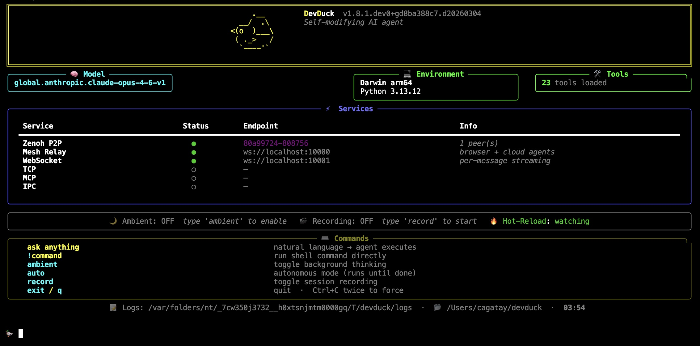

<p align="center">
  
</p>

# 🦆 DevDuck

[](https://pypi.org/project/devduck/)

**One file. Self-healing. Builds itself as it runs.**

An AI agent that hot-reloads its own code, fixes itself when things break, and expands capabilities at runtime. Terminal, browser, cloud — or all at once.

```bash
pipx install devduck && devduck
```

<p align="center">
  
</p>

<p align="center">
  <video src="https://github.com/cagataycali/devduck/raw/main/devduck-intro.mp4" width="700" controls autoplay muted>
    <a href="https://redduck.dev/videos/devduck-intro.mp4">Watch the intro</a>
  </video>
</p>

---

## What It Does

- **Hot-reloads** — edit source, agent restarts instantly
- **Self-heals** — errors trigger automatic recovery
- **60+ tools** — shell, GitHub, browser control, speech, scheduler, ML, messaging
- **Multi-protocol** — CLI, TUI, WebSocket, TCP, MCP, IPC, Zenoh P2P
- **Unified mesh** — terminal + browser + cloud agents in one network
- **Deploys anywhere** — `devduck deploy --launch` → AWS AgentCore

**Requirements:** Python 3.10–3.13 + any model provider (AWS, Anthropic, OpenAI, Ollama, Gemini, etc.)

---

## Quick Start

```bash
devduck                              # interactive REPL
devduck --tui                        # multi-conversation terminal UI
devduck "create a REST API"          # one-shot
devduck --record                     # record session for replay
devduck --resume session.zip         # resume from snapshot
devduck deploy --launch              # ship to AgentCore
```

```python
import devduck
devduck("analyze this code")
```

---

## Model Detection

Set your key. DevDuck figures out the rest.

```bash
export ANTHROPIC_API_KEY=sk-ant-...   # → uses Anthropic
export OPENAI_API_KEY=sk-...          # → uses OpenAI
export GOOGLE_API_KEY=...             # → uses Gemini
# or just have AWS credentials        # → uses Bedrock
# or nothing at all                   # → uses Ollama
```

**Priority:** Bedrock → Anthropic → OpenAI → GitHub → Gemini → Cohere → Writer → Mistral → LiteLLM → LlamaAPI → MLX → Ollama

Override: `MODEL_PROVIDER=bedrock STRANDS_MODEL_ID=us.anthropic.claude-sonnet-4-20250514-v1:0 devduck`

---

## Tools

### Runtime — no restart needed

```python
manage_tools(action="add", tools="strands_fun_tools.cursor")
manage_tools(action="create", code='...')
manage_tools(action="fetch", url="https://github.com/user/repo/blob/main/tool.py")
```

### Hot-reload from disk

Drop a `.py` file in `./tools/` → it's available immediately.

```python
# ./tools/weather.py
from strands import tool
import requests

@tool
def weather(city: str) -> str:
    """Get weather for a city."""
    return requests.get(f"https://wttr.in/{city}?format=%C+%t").text
```

### Static config

```bash
export DEVDUCK_TOOLS="strands_tools:shell,editor;devduck.tools:use_github,scheduler"
```

---

## Architecture

```
devduck/
├── __init__.py       # the whole agent — single file
├── tui.py            # multi-conversation Textual UI
├── tools/            # 60+ built-in tools (hot-reloadable)
└── agentcore_handler.py  # AWS AgentCore deployment handler
```

```
User → [CLI/TUI/WS/TCP/MCP/IPC] → DevDuck Core → Tools → Response
                                        ↕                    ↕
                                   Zenoh P2P            Knowledge Base
                                        ↕
                                  Browser + Cloud
                                  (Unified Mesh)
```

**Ports:** 10000 (mesh relay) · 10001 (WebSocket) · 10002 (TCP) · 10003 (MCP)

---

## Multi-Agent Networking

### Zenoh P2P — zero config

```bash
# Terminal 1
devduck   # → Zenoh peer: hostname-abc123

# Terminal 2
devduck   # auto-discovers Terminal 1
```

```python
zenoh_peer(action="broadcast", message="git pull && npm test")  # all peers
zenoh_peer(action="send", peer_id="hostname-abc123", message="status?")  # one peer
```

Cross-network: `ZENOH_CONNECT=tcp/remote:7447 devduck`

### Unified Mesh — everything connected

Terminal DevDucks (Zenoh) + browser tabs (WebSocket) + AgentCore agents (AWS) share one ring context. Open `mesh.html` to join from a browser.

---

## Deploy

```bash
devduck deploy --launch
devduck deploy --name reviewer --tools "strands_tools:shell,editor" --launch
devduck list        # see deployed agents
devduck invoke "analyze code" --name reviewer
```

---

## Session Recording & Resume

```bash
devduck --record                  # captures sys/tool/agent events
devduck --resume session.zip      # restores conversation + state
devduck --resume session.zip "continue where we left off"
```

```python
from devduck import load_session
session = load_session("session.zip")
session.resume_from_snapshot(2, agent=devduck.agent)
```

Asciinema: `DEVDUCK_ASCIINEMA=true devduck` → shareable `.cast` files.

---

## Background Modes

```bash
# Standard ambient — thinks while you're idle
DEVDUCK_AMBIENT_MODE=true devduck

# Autonomous — works until done
🦆 auto
# Agent signals [AMBIENT_DONE] when finished
```

---

## Messaging

```bash
# Telegram
TELEGRAM_BOT_TOKEN=... STRANDS_TELEGRAM_AUTO_REPLY=true devduck
telegram(action="start_listener")

# Slack
SLACK_BOT_TOKEN=xoxb-... SLACK_APP_TOKEN=xapp-... devduck
slack(action="start_listener")

# WhatsApp (via wacli, no Cloud API)
whatsapp(action="start_listener")
```

Each incoming message spawns a fresh DevDuck with full tool access.

---

## MCP

**Expose as server** (Claude Desktop):
```json
{"mcpServers": {"devduck": {"command": "uvx", "args": ["devduck", "--mcp"]}}}
```

**Load external servers:**
```bash
export MCP_SERVERS='{"mcpServers": {"docs": {"command": "uvx", "args": ["strands-agents-mcp-server"]}}}'
```

---

## macOS

```python
use_mac(action="calendar.events", days=7)
use_mac(action="mail.send", to="x@y.com", subject="Hi", body="Hello")
use_mac(action="safari.read")
use_mac(action="system.screenshot", path="/tmp/shot.png")
use_mac(action="system.dark_mode", enable=True)
use_mac(action="keychain.get", service="MyApp", account="me")

apple_notes(action="list")
use_spotify(action="now_playing")
```

---

## More Tools

| Tool | What |
|------|------|
| `shell` | Interactive PTY shell |
| `editor` | File create/replace/insert/undo |
| `use_github` | GitHub GraphQL API |
| `use_computer` | Mouse, keyboard, screenshots |
| `listen` | Background Whisper transcription |
| `lsp` | Language server diagnostics |
| `scheduler` | Cron + one-time jobs |
| `tasks` | Parallel background agents |
| `sqlite_memory` | Persistent memory with FTS |
| `dialog` | Rich terminal UI dialogs |
| `speech_to_speech` | Nova Sonic / OpenAI / Gemini voice |
| `rl` | Train RL agents, fine-tune LLMs |
| `scraper` | HTML/XML parsing |
| `use_agent` | Nested agents with different models |
| `retrieve` / `store_in_kb` | Bedrock Knowledge Base RAG |

<details>
<summary><strong>All 60+ tools</strong></summary>

**Core:** system_prompt · manage_tools · manage_messages · tasks · scheduler · sqlite_memory · dialog · notify · use_computer · listen · lsp · tui · session_recorder · view_logs

**Network:** tcp · websocket · ipc · mcp_server · zenoh_peer · agentcore_proxy · unified_mesh · mesh_registry · jsonrpc

**Platform:** use_mac · apple_notes · use_spotify · telegram · whatsapp · slack

**Cloud:** use_github · fetch_github_tool · gist · agentcore_config · agentcore_invoke · agentcore_logs · agentcore_agents · create_subagent · store_in_kb · retrieve

**AI/ML:** rl · speech_to_speech · use_agent · scraper

**macOS Native:** apple_nlp · apple_vision · apple_wifi · apple_sensors · apple_smc

**Strands:** shell · editor · file_read · file_write · calculator · image_reader · speak

</details>

---

## AGENTS.md

Drop an `AGENTS.md` in your working directory. DevDuck auto-loads it into the system prompt. No config needed.

```markdown
# AGENTS.md
## Project: My API
- Framework: FastAPI
- Tests: pytest
- Deploy: Docker on ECS
```

---

## Config Reference

<details>
<summary><strong>All environment variables</strong></summary>

| Variable | Default | What |
|----------|---------|------|
| `MODEL_PROVIDER` | auto | `bedrock` `anthropic` `openai` `github` `gemini` `cohere` `writer` `mistral` `litellm` `llamaapi` `mlx` `ollama` |
| `STRANDS_MODEL_ID` | auto | Model name |
| `DEVDUCK_TOOLS` | 60+ tools | `package:tool1,tool2;package2:tool3` |
| `DEVDUCK_LOAD_TOOLS_FROM_DIR` | `false` | Auto-load `./tools/*.py` |
| `DEVDUCK_KNOWLEDGE_BASE_ID` | — | Bedrock KB for auto-RAG |
| `MCP_SERVERS` | — | JSON config for MCP servers |
| `DEVDUCK_ENABLE_WS` | `true` | WebSocket server |
| `DEVDUCK_ENABLE_ZENOH` | `true` | Zenoh P2P |
| `DEVDUCK_ENABLE_AGENTCORE_PROXY` | `true` | Mesh relay |
| `DEVDUCK_ENABLE_TCP` | `false` | TCP server |
| `DEVDUCK_ENABLE_MCP` | `false` | MCP HTTP server |
| `DEVDUCK_ENABLE_IPC` | `false` | IPC socket |
| `DEVDUCK_WS_PORT` | `10001` | WebSocket port |
| `DEVDUCK_TCP_PORT` | `10002` | TCP port |
| `DEVDUCK_MCP_PORT` | `10003` | MCP port |
| `DEVDUCK_AGENTCORE_PROXY_PORT` | `10000` | Mesh relay port |
| `DEVDUCK_AMBIENT_MODE` | `false` | Background thinking |
| `DEVDUCK_AMBIENT_IDLE_SECONDS` | `30` | Idle before ambient starts |
| `DEVDUCK_AMBIENT_MAX_ITERATIONS` | `3` | Max ambient iterations |
| `DEVDUCK_AUTONOMOUS_MAX_ITERATIONS` | `100` | Max autonomous iterations |
| `DEVDUCK_ASCIINEMA` | `false` | Record `.cast` files |
| `DEVDUCK_LSP_AUTO_DIAGNOSTICS` | `false` | Auto LSP after edits |
| `TELEGRAM_BOT_TOKEN` | — | Telegram bot |
| `SLACK_BOT_TOKEN` | — | Slack bot |
| `SPOTIFY_CLIENT_ID` | — | Spotify |

</details>

---

## Dev Setup

```bash
git clone git@github.com:cagataycali/devduck.git && cd devduck
python3.13 -m venv .venv && source .venv/bin/activate
pip install -e . && devduck
```

---

## GitHub Actions

```yaml
- uses: cagataycali/devduck@main
  with:
    task: "Review this PR"
    provider: "github"
    model: "gpt-4o"
  env:
    GITHUB_TOKEN: ${{ secrets.GITHUB_TOKEN }}
```

---

## Citation

```bibtex
@software{devduck2025,
  author = {Cagatay Cali},
  title = {DevDuck: Self-Modifying AI Agent},
  year = {2025},
  url = {https://github.com/cagataycali/devduck}
}
```

---

**Apache 2.0** · Built with [Strands Agents](https://strandsagents.com) · [@cagataycali](https://github.com/cagataycali)
