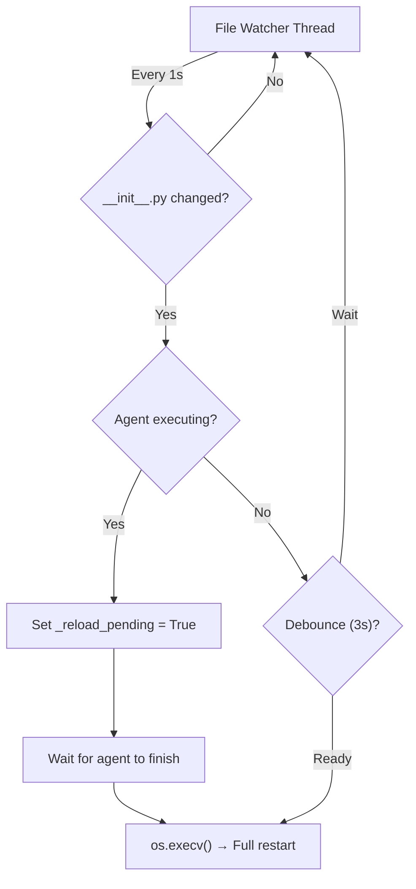

# Hot Reload

Modify DevDuck's code while it's running. Changes apply instantly without losing context.

---

## How It Works



A background thread watches `devduck/__init__.py`. When a change is detected:

1. **Agent idle** → Immediate restart via `os.execv()`
2. **Agent executing** → `_reload_pending` flag set, reload triggers after completion
3. **Debounce** → 3-second window prevents rapid reloads

---

## Live Demo

```
🦆 # DevDuck running normally...

# You edit devduck/__init__.py in another terminal

🦆 Detected changes in __init__.py!
🦆 Restarting process with fresh code...
🦆 DevDuck
📝 Logs: /tmp/devduck/logs
🦆 ✓ Zenoh peer: hostname-abc123
🦆 # Ready with your changes!
```

### During Agent Execution

```
🦆 run a complex task...
🛠️ Tool #1: shell

# You edit code while agent is working...

🦆 Agent is currently executing - reload will trigger after completion

✅ Tool completed successfully

[Agent finishes response]
🦆 Agent finished - triggering pending hot-reload...
🦆 Restarting process with fresh code...
```

!!! warning "Safe Reload"
    Hot reload **never** interrupts a running agent. The `_reload_pending` flag ensures no lost work or corrupted state.

---

## Tool Hot Loading

Create new tools by saving `.py` files to the `./tools/` directory:

```python
# ./tools/weather.py
from strands import tool
import requests

@tool
def weather(city: str) -> str:
    """Get weather for a city."""
    return requests.get(f"https://wttr.in/{city}?format=%C+%t").text
```

The tool is **immediately available** — no restart needed. DevDuck's `load_tools_from_directory=True` picks it up automatically.

---

## Configuration

| Variable | Default | Description |
|----------|---------|-------------|
| `DEVDUCK_LOAD_TOOLS_FROM_DIR` | `true` | Auto-load `./tools/*.py` |

The file watcher monitors `devduck/__init__.py` specifically. Tool directory loading is handled by the Strands Agent SDK's built-in mechanism.
