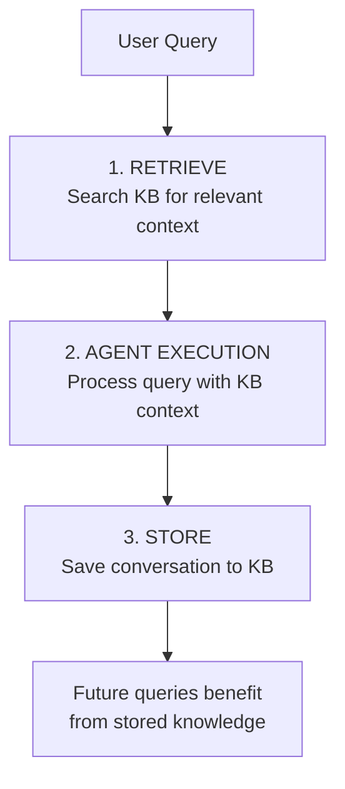

# Knowledge Base

Automatic RAG with Amazon Bedrock Knowledge Bases. Seamless memory across sessions.

---

## How It Works



When `DEVDUCK_KNOWLEDGE_BASE_ID` is set, DevDuck automatically:

1. **Before each query** — Retrieves relevant context from the knowledge base
2. **Runs the agent** — Processes query enriched with retrieved context
3. **After each response** — Stores the conversation for future reference

---

## Quick Start

One environment variable:

```bash
export DEVDUCK_KNOWLEDGE_BASE_ID="your-kb-id-here"
devduck
```

Every query now has automatic RAG — no manual tool calls needed.

---

## Manual Tool Usage

You can also use the knowledge base tools directly:

```python
# Retrieve from knowledge base
retrieve(
    text="how do I configure bedrock?",
    knowledgeBaseId="your-kb-id"
)

# Store to knowledge base
store_in_kb(
    content="Important finding: the API rate limit is 1000/min",
    title="API Rate Limits",
    knowledge_base_id="your-kb-id"
)
```

---

## Configuration

| Variable | Description |
|----------|-------------|
| `DEVDUCK_KNOWLEDGE_BASE_ID` | Bedrock Knowledge Base ID for automatic RAG |
| `STRANDS_KNOWLEDGE_BASE_ID` | Alternative KB ID for the `retrieve` tool |

---

## What Gets Stored

Each conversation is stored as:

- **Content**: `Input: {query}, Result: {response}`
- **Title**: `DevDuck: {date} | {query preview}`

This builds a growing knowledge base that makes future queries more informed.

!!! tip "Cross-Session Memory"
    Knowledge persists across DevDuck sessions. Start a new session and your previous conversations are available as context.
