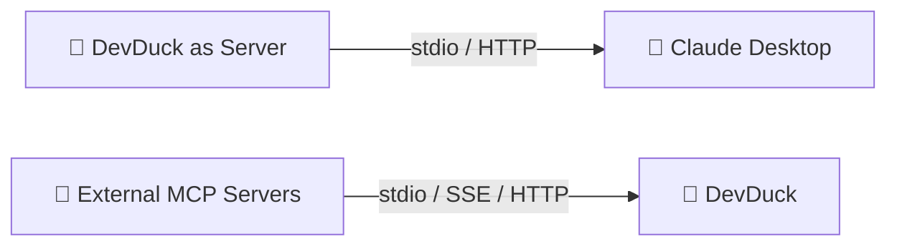

# MCP Integration

Model Context Protocol — expose DevDuck as a server or load external MCP servers.

---

## Two-Way Integration



---

## Expose DevDuck as MCP Server

### Stdio Mode (Claude Desktop)

```bash
devduck --mcp
```

#### Claude Desktop Configuration

Add to `~/Library/Application Support/Claude/claude_desktop_config.json`:

```json
{
    "mcpServers": {
        "devduck": {
            "command": "uvx",
            "args": ["devduck", "--mcp"]
        }
    }
}
```

### HTTP Mode (Web Clients)

```python
mcp_server(action="start", transport="http", port=10003, expose_agent=True)
```

Access at: `http://localhost:10003/mcp`

### Tool API

```python
# Start MCP server
mcp_server(
    action="start",
    transport="http",    # or "stdio"
    port=10003,
    expose_agent=True
)

# Check status
mcp_server(action="status")

# Stop
mcp_server(action="stop")
```

---

## Load External MCP Servers

Import tools from external MCP servers via the `MCP_SERVERS` environment variable.

```bash
export MCP_SERVERS='{
    "mcpServers": {
        "strands-docs": {
            "command": "uvx",
            "args": ["strands-agents-mcp-server"]
        },
        "github": {
            "command": "npx",
            "args": ["-y", "@modelcontextprotocol/server-github"],
            "env": { "GITHUB_TOKEN": "your-token" }
        }
    }
}'
devduck
```

### Supported Transport Types

| Transport | Config Keys | Example |
|-----------|-------------|---------|
| **Stdio** | `command`, `args`, `env` | Local CLI tools, uvx packages |
| **SSE** | `url` (with `/sse`) | Server-sent events endpoints |
| **HTTP** | `url`, `headers` | Streamable HTTP endpoints |

### HTTP Server Example

```json
{
    "mcpServers": {
        "remote-tools": {
            "url": "https://api.example.com/mcp",
            "headers": {
                "Authorization": "Bearer your-token"
            }
        }
    }
}
```

!!! tip "Auto-loaded"
    Tools from MCP servers are automatically available in the agent context — no manual registration needed.
