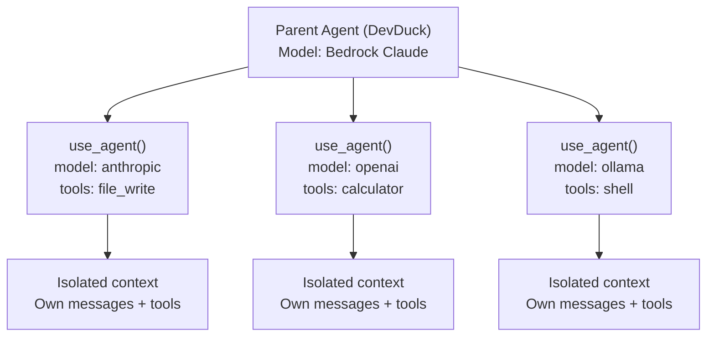

# Multi-Agent

Spawn isolated sub-agents with different models, system prompts, and tool sets.

---

## How It Works



Each sub-agent runs in its own isolated context with:

- **Different model provider** — mix cloud + local
- **Custom system prompt** — specialized personality
- **Limited tools** — only what's needed (security)
- **Own message history** — no context bleed

---

## use_agent Tool

| Parameter | Type | Description |
|-----------|------|-------------|
| `prompt` | string (required) | The task for the sub-agent |
| `system_prompt` | string (required) | Custom personality/instructions |
| `model_provider` | string | `bedrock`, `anthropic`, `openai`, `ollama`, `env`, etc. |
| `model_settings` | object | `{"model_id": "...", "params": {...}}` |
| `tools` | array | Tool names to make available |

---

## Examples

### Different Model for Creative Task

```python
use_agent(
    prompt="Write a haiku about artificial intelligence",
    system_prompt="You are a minimalist poet who writes profound haikus.",
    model_provider="anthropic"
)
```

### Local Model for Privacy

```python
use_agent(
    prompt="Summarize this confidential document",
    system_prompt="You summarize documents concisely. Never output raw data.",
    model_provider="ollama",
    model_settings={"model_id": "qwen3:8b"}
)
```

### Tool Isolation

```python
# Sub-agent can only read files, not write or execute
use_agent(
    prompt="Review this code for security issues",
    system_prompt="You are a security auditor.",
    model_provider="bedrock",
    tools=["file_read"]
)
```

### Model Comparison

```python
# Get answers from multiple models
for provider in ["anthropic", "openai", "bedrock"]:
    use_agent(
        prompt="Explain quantum computing in one sentence",
        system_prompt="You are concise and precise.",
        model_provider=provider
    )
```

### Specialized Workflows

```python
# Step 1: Research with web access
use_agent(
    prompt="Find the latest Python 3.13 features",
    system_prompt="You are a research assistant.",
    tools=["shell", "scraper"]
)

# Step 2: Code with file access
use_agent(
    prompt="Write a demo using the new features",
    system_prompt="You are a Python expert.",
    tools=["file_write", "editor", "shell"]
)
```

---

## Zenoh P2P Multi-Agent

For distributed multi-agent coordination across machines, see [Zenoh P2P](zenoh.md).

```python
# Broadcast a task to all connected DevDuck instances
zenoh_peer(action="broadcast", message="run linting on your current project")

# Send to a specific peer
zenoh_peer(action="send", peer_id="hostname-abc123", message="deploy to staging")
```
