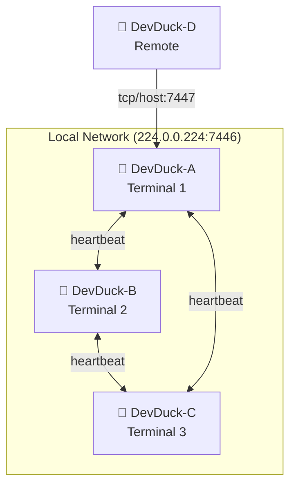

# Zenoh P2P

Multiple DevDuck instances auto-discover each other and communicate. No configuration needed.

---

## How It Works



Zenoh uses **multicast scouting** to automatically discover peers on the same network. No central server required.

### Key Expressions

| Expression | Purpose |
|-----------|---------|
| `devduck/presence/{id}` | Heartbeat announcements (every 5s) |
| `devduck/broadcast` | Commands to ALL peers |
| `devduck/cmd/{id}` | Direct commands to specific peer |
| `devduck/response/{id}/*` | Streaming responses back |

---

## Quick Start

### Terminal 1 — Start First Instance

```bash
devduck
# 🦆 ✓ Zenoh peer: hostname-abc123
```

### Terminal 2 — Auto-Discovery

```bash
devduck
# 🦆 ✓ Zenoh peer: hostname-def456
# Automatically discovers Terminal 1!
```

### Check Peers

```python
zenoh_peer(action="list_peers")
# 🔗 Discovered Peers (1):
#   🦆 hostname-abc123
#     Host: mycomputer
#     Seen: 2.1s ago
```

---

## Broadcasting

Send a command to **all** connected peers:

```python
zenoh_peer(action="broadcast", message="what directory are you in?")
# 🦆 [hostname-def456] Processing...
#   I'm currently in /Users/cagatay/project-b
# ✅ [hostname-def456] Complete (12 chunks)
```

All peers execute the command and stream responses back.

---

## Direct Messaging

Send to a **specific** peer:

```python
zenoh_peer(action="send", peer_id="hostname-abc123", message="deploy to staging")
```

---

## Remote Connections

Connect DevDuck instances across different networks:

```python
# Listen for remote connections
zenoh_peer(action="start", listen="tcp/0.0.0.0:7447")

# Connect to a remote peer
zenoh_peer(action="start", connect="tcp/remote-host:7447")
```

Or via environment variables:

```bash
export ZENOH_LISTEN=tcp/0.0.0.0:7447
export ZENOH_CONNECT=tcp/home.example.com:7447
devduck
```

---

## Tool API Reference

| Action | Description |
|--------|-------------|
| `start` | Start Zenoh networking |
| `stop` | Stop Zenoh |
| `status` | Show status and peer count |
| `list_peers` | List all discovered peers |
| `broadcast` | Send command to ALL peers |
| `send` | Send command to specific peer |

---

## Use Cases

- **Multi-terminal coordination** — `git pull && npm install` across all instances
- **Distributed task execution** — Split work across machines
- **Peer monitoring** — See all active DevDuck instances
- **Cross-network collaboration** — Connect home and office DevDucks
