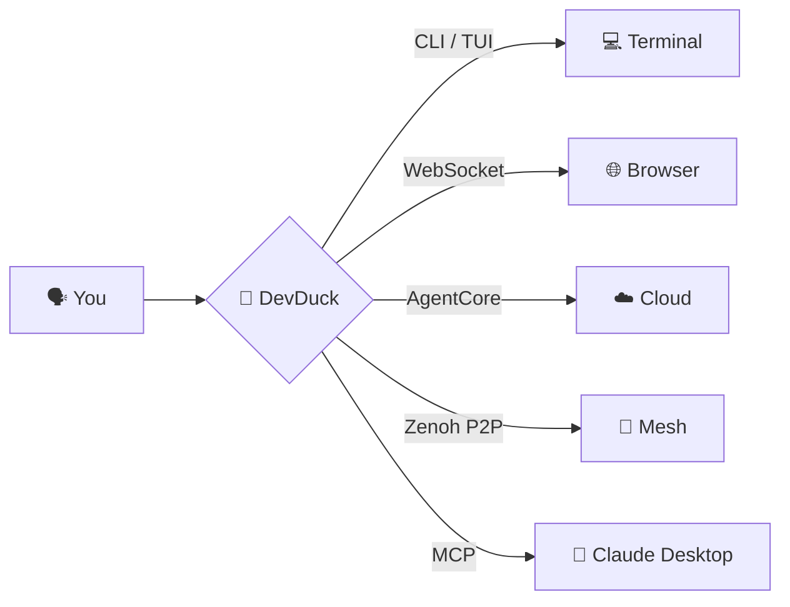

<div align="center">
  
  <h1>DevDuck</h1>
  <p><strong>Extreme minimalist self-adapting AI agent.</strong></p>
  <p>One file. Self-healing. Builds itself as it runs.</p>
</div>

[](https://pypi.org/project/devduck/)

---

## See It In Action

<video src="https://github.com/cagataycali/devduck/raw/main/devduck-intro.mp4" width="100%" controls muted></video>

---

## What Is DevDuck?

An AI agent that **hot-reloads its own code**, fixes itself when things break, and expands capabilities at runtime. Terminal, browser, cloud — or all at once.

```bash
pipx install devduck && devduck
```



---

## Features

<div class="grid cards" markdown>

-   **🔄 Hot Reload**

    Edit source code while the agent runs. Changes apply instantly without restart. Protected during execution.

    → [Learn more](guide/hot-reload.md)

-   **🛠️ 60+ Tools**

    Shell, GitHub, browser control, speech, scheduler, ML, messaging. Load more at runtime from any Python package.

    → [Learn more](guide/tools.md)

-   **🤖 14 Model Providers**

    Bedrock, Anthropic, OpenAI, Gemini, Ollama, and 9 more. Auto-detects credentials and picks the best available.

    → [Learn more](guide/models.md)

-   **🌙 Ambient Mode**

    Background thinking while you're idle. Standard mode explores topics; autonomous mode builds entire features.

    → [Learn more](guide/ambient-mode.md)

-   **🔌 Zenoh P2P**

    Multiple DevDuck instances auto-discover each other. Broadcast commands to all or send to specific peers.

    → [Learn more](guide/zenoh.md)

-   **🎬 Session Recording**

    Record complete sessions with three-layer capture. Resume from any snapshot with full conversation state.

    → [Learn more](guide/session-recording.md)

-   **🔗 MCP Integration**

    Expose as MCP server for Claude Desktop, or load external MCP servers to extend capabilities.

    → [Learn more](guide/mcp.md)

-   **☁️ AgentCore Deploy**

    Deploy to Amazon Bedrock AgentCore with one command. Unified mesh connects CLI + browser + cloud agents.

    → [Learn more](guide/agentcore.md)

</div>

---

## Quick Start

```bash
devduck                              # interactive REPL
devduck --tui                        # multi-conversation TUI
devduck "create a REST API"          # one-shot
devduck --record                     # record session for replay
devduck --resume session.zip         # resume from snapshot
devduck deploy --launch              # ship to AgentCore
devduck service install --name bot   # persist as systemd/launchd service
```

```python
import devduck
devduck("analyze this code")
```

→ **[Installation](getting-started/installation.md)** | **[Quickstart](getting-started/quickstart.md)**

---

## Model Detection

Set your key. DevDuck figures out the rest.

```bash
export ANTHROPIC_API_KEY=sk-ant-...   # → uses Anthropic
export OPENAI_API_KEY=sk-...          # → uses OpenAI
export GOOGLE_API_KEY=...             # → uses Gemini
# or just have AWS credentials        # → uses Bedrock
# or nothing at all                   # → uses Ollama
```

**Priority:** Bedrock → Anthropic → OpenAI → GitHub → Gemini → Cohere → Writer → Mistral → LiteLLM → LlamaAPI → MLX → Ollama

→ **[All 14 providers](guide/models.md)**

---

## Access Methods

| Protocol | Port | Description |
|----------|------|-------------|
| CLI/REPL | — | `devduck` interactive mode |
| TUI | — | `devduck --tui` multi-conversation UI |
| MCP stdio | — | `devduck --mcp` for Claude Desktop |
| Mesh Relay | 10000 | Browser + AgentCore agents |
| WebSocket | 10001 | Per-message streaming |
| TCP | 10002 | Raw socket (opt-in) |
| MCP HTTP | 10003 | Model Context Protocol (opt-in) |
| Zenoh P2P | multicast | Auto-discovery across networks |

→ **[Servers guide](guide/servers.md)**

---

## Quick Links

<div class="grid" markdown>

[:material-download: **Installation** →](getting-started/installation.md)

[:material-rocket-launch: **Quickstart** →](getting-started/quickstart.md)

[:material-refresh: **Hot Reload** →](guide/hot-reload.md)

[:material-tools: **Tools** →](guide/tools.md)

[:material-robot: **Models** →](guide/models.md)

[:material-transit-connection-variant: **Zenoh P2P** →](guide/zenoh.md)

[:material-moon-waning-crescent: **Ambient Mode** →](guide/ambient-mode.md)

[:material-record-circle: **Session Recording** →](guide/session-recording.md)

[:material-file-tree: **Architecture** →](architecture.md)

[:material-code-tags: **API Reference** →](api-reference.md)

</div>

---

## Resources

- [GitHub Repository](https://github.com/cagataycali/devduck)
- [PyPI Package](https://pypi.org/project/devduck/)
- [Strands Agents SDK](https://strandsagents.com)
